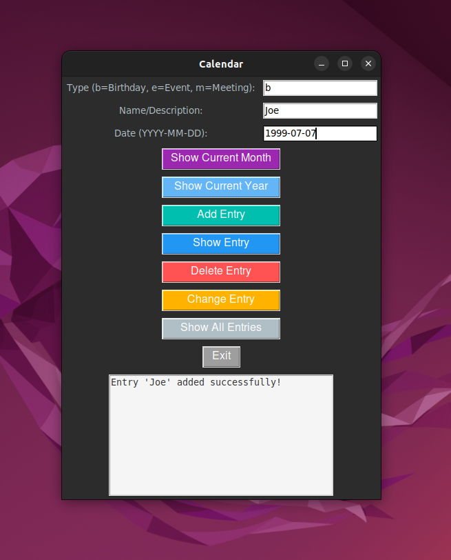
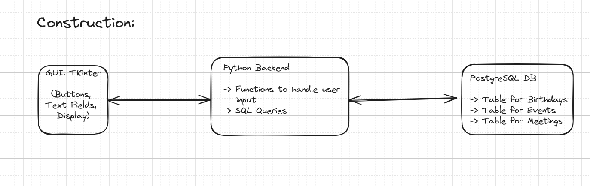
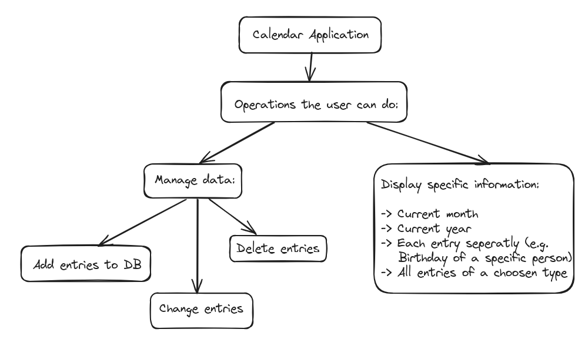
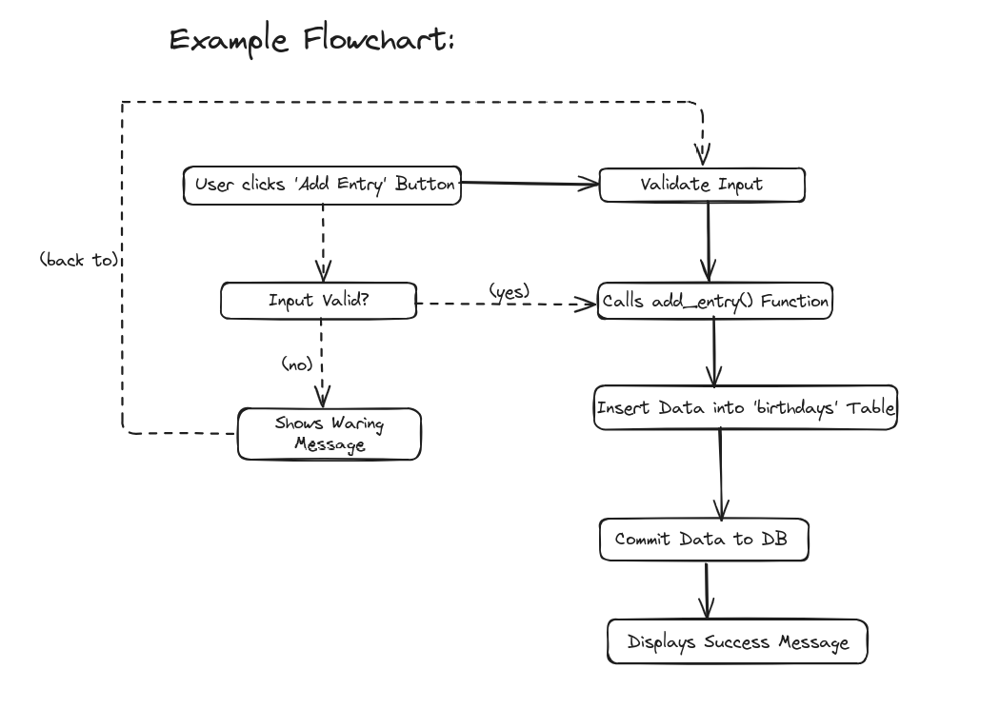

# **calendar_project_2** 
A simple calendar application built with Python and Tkinter that allows users to manage their calendar events, including birthdays, meetings, and events. This program connects to a PostgreSQL database to store, retrieve, update, and delete entries.

## Requirements:
Before running the program, make sure you have the following installed:
- Python 3
- Tkinter for the GUI
- PostgreSQL for database management
- psycopg2 library for connecting to PostgreSQL
- python-dotenv to load environment variables
  

---

## How to Run:
 - Clone the repository
 - Set up (create) the PostgreSQL database: calendar_db;
 - Create a .env file in the root directory with your PostgreSQL connection details
 - Run the application (python main.py)

## Once the program is running, the Tkinter interface provides the following options:
- Show Current Month: Display the calendar of the current month.
- Show Current Year: Display the full year’s calendar.
- Add Entry: Add a new entry (Birthday, Event, or Meeting) to the calendar.
- Show Entry: Search for a specific entry by name or description.
- Delete Entry: Delete an entry from the calendar.
- Change Entry: Update the date of an existing entry.
- Show All Entries: View all entries of a specific type (Birthday, Event, or Meeting).
- Exit: Exit the application.
  

## Example Workflow:
- To add a birthday, select 'b' for Birthday, enter a name (e.g., "John's Birthday"), and provide a date (e.g., "2024-05-15").
- To view a birthday, select 'b' and enter the name you want to search for.
- To delete a meeting, select 'm' for Meeting, provide the name of the meeting, and click the "Delete Entry" button.
- To view all events, select 'e' for Event and click the "Show All Entries" button.
  

## Next Steps:
- Implement email funtion!

